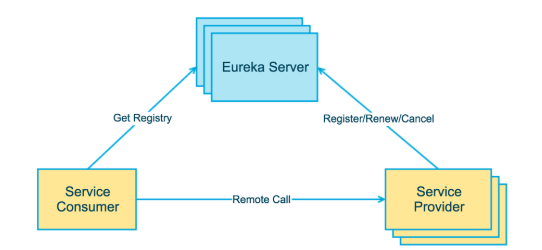
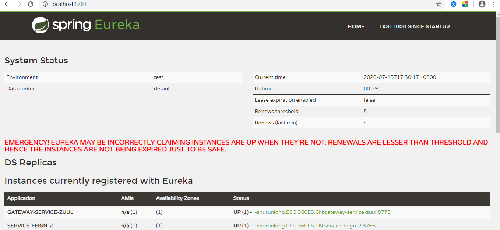

# eureka

##1  eureka介绍

Eureka用于管理各种服务功能包括服务的注册、发现、熔断、负载、降级等 

Eureka由两个组件组成：Eureka服务器和Eureka客户端。Eureka服务器用作服务注册服务器。Eureka客户端是一个java客户端，用来简化与服务器的交互、作为轮询负载均衡器，并提供服务的故障切换支持。Netflix在其生产环境中使用的是另外的客户端，它提供基于流量、资源利用率以及出错状态的加权负载均衡。 

上图描述了Eureka的基本架构，由3个角色组成：

1、Eureka Server

- 提供服务注册和发现

2、Service Provider

- 服务提供方
- 将自身服务注册到Eureka，从而使服务消费方能够找到

3、Service Consumer

- 服务消费方
- 从Eureka获取注册服务列表，从而能够消费服务

##2 运行演示

Eureka 服务端代码见:   /_01_eureka_server

注册中心访问: http://localhost:8761/

3 配置文件

