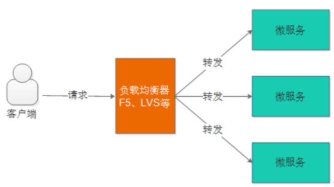
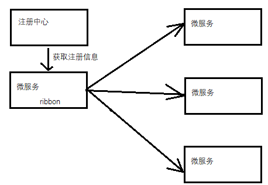
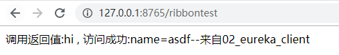
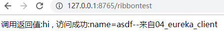
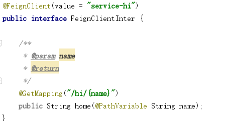
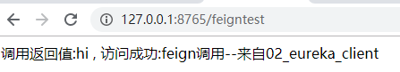
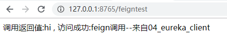

# Ribbon&Feign

##1 Ribbon介绍

​      Spring Cloud Ribbon是一个基于HTTP和TCP的客户端负载均衡工具，它基于Netflix Ribbon实现。通过Spring Cloud的封装，可以让我们轻松地将面向服务的REST模版请求自动转换成客户端负载均衡的服务调用.

**服务端负载均衡**:

用户请求先到达负载均衡器（也相当于一个服务），负载均衡器根据负载均衡算法将请求转发到微服务。负载均衡 算法有：**轮训**、**随机**、**加权轮训**、**加权随机**、**地址哈希**等方法，负载均衡器维护一份服务列表，根据负载均衡算法 将请求转发到相应的微服务上，所以负载均衡可以为微服务集群分担请求，降低系统的压力.

**客户端负载均衡**:

   客户端负载均衡与服务端负载均衡的区别在于客户端要维护一份服务列表，Ribbon从 Eureka Server获取服务列表，Ribbon根据负载均衡算法直接请求到具体的微服务，**中间省去了负载均衡服务**。

 

## 2 运行演示

<http://127.0.0.1:8765/ribbontest> 

## 3 Feign介绍

   Feign 的英文表意为“假装，伪装，变形”， 是一个http请求调用的轻量级框架，**封装了Http调用流程，更适合面向接口化的变成习惯**

1、 启动类添加@EnableFeignClients注解，Spring会扫描标记了@FeignClient注解的接口，并生成此接口的代理 对象

 2、 @FeignClient(value = "service-hi"))即指定了微服务的服务名称， ribbon从注册中心获取注册列表, 并根据负载均衡的算法进行服务调用

feign的使用注意事项:

SpringCloud对Feign进行了增强兼容了SpringMVC的注解 ，我们在使用SpringMVC的注解时需要注意： 

1、feignClient接口 有参数在参数必须加@PathVariable("XXX")和@RequestParam("XXX") 

2、feignClient返回值为复杂对象时其类型必须有无参构造函数。  

## 4 运行演示

<http://127.0.0.1:8765/feigntest> 

