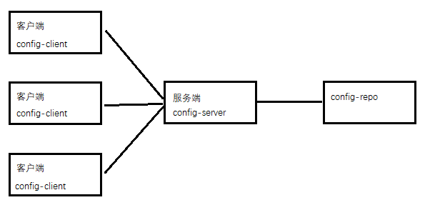
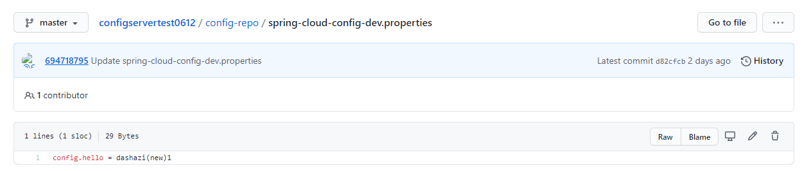

# config_server

## 1 介绍

每个项目都会有很多的配置文件，如果采用分布式的开发模式，需要的配置文件随着服务增加而不断增多。配置中心专门解决此类问题

Spring Cloud Config核心功能：

- 提供服务端和客户端支持
- 集中管理各环境的配置文件
- 配置文件修改之后，可以快速的生效
- 可以进行版本管理
- 支持大的并发查询
- 支持各种语言

Spring Cloud Config项目是一个解决分布式系统的配置管理方案。它包含了Client和Server两个部分，

**server提供配置文件的存储、以接口的形式将配置文件的内容提供出去**，

**client通过接口获取数据、并依据此数据初始化自己的应用。** 

## 2 配置中心演示运行

在github上面创建了一个文件夹config-repo用来存放配置文件

github地址:  <https://github.com/694718795/configservertest0612/blob/master/config-repo/spring-cloud-config-dev.properties> 

更新配置刷新接口: 