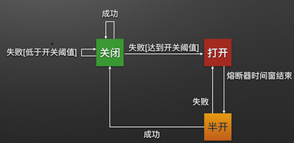

# hystrix

##1 hystrix介绍

熔断器:

熔断器的原理如同电力过载保护器。它可以实现**快速失败**，如果它在一段时间内侦测到许多类似的错误，会强迫其以后的多个调用快速失败，不再访问远程服务器，从而防止应用程序不断地尝试执行可能会失败的操作，使得应用程序继续执行而不用等待修正错误，或者浪费CPU时间去等到长时间的超时产生。熔断器也可以使应用程序能够诊断错误是否已经修正，如果已经修正，应用程序会再次尝试调用操作。 

熔断器模式就像是那些容易导致错误的操作的一种代理。这种代理能够记录最近调用发生错误的次数，然后决定使用允许操作继续，或者立即返回错误 



## 2 hystrix的机制

**1.断路器机制**

断路器很好理解, 当Hystrix Command请求后端服务失败数量超过一定比例(默认50%), 断路器会切换到开路状态(Open). 这时所有请求会直接失败而不会发送到后端服务. 断路器保持在开路状态一段时间后(默认5秒), 自动切换到半开路状态(HALF-OPEN). 这时会判断下一次请求的返回情况, 如果请求成功, 断路器切回闭路状态(CLOSED), 否则重新切换到开路状态(OPEN). Hystrix的断路器就像我们家庭电路中的保险丝, 一旦后端服务不可用, 断路器会直接切断请求链, 避免发送大量无效请求影响系统吞吐量, 并且断路器有自我检测并恢复的能力.

**2.Fallback**

Fallback相当于是降级操作. 对于查询操作, 我们可以实现一个fallback方法, 当请求后端服务出现异常的时候, 可以使用fallback方法返回的值. fallback方法的返回值一般是设置的默认值或者来自缓存.

**3.资源隔离**

在Hystrix中, 主要通过线程池来实现资源隔离. 通常在使用的时候我们会根据调用的远程服务划分出多个线程池. 例如调用产品服务的Command放入A线程池, 调用账户服务的Command放入B线程池. 这样做的主要优点是运行环境被隔离开了. 这样就算调用服务的代码存在bug或者由于其他原因导致自己所在线程池被耗尽时, 不会对系统的其他服务造成影响. 但是带来的代价就是维护多个线程池会对系统带来额外的性能开销. 如果是对性能有严格要求而且确信自己调用服务的客户端代码不会出问题的话, 可以使用Hystrix的信号模式(Semaphores)来隔离资源.

## 3 使用


#### 1 配置文件

```yml
# 熔断器设置
feign:
  hystrix:
    enabled: true
```

#### 2 添加fallback属性

指定fallback类(ServiceHiHystrix.class),当服务熔断后调用fallback类中的内容

```java
/**
 * <p>一个Feign服务消费者接口</p>
 **/
@FeignClient(value = "service-hi", fallback = ServiceHiHystrix.class)
public interface ServiceHi {
    /**
     * <p>通过Feign伪Http客户端调用service-hi提供的服务</p>
     * @author hanchao 2018/5/19 17:59
     **/
    @GetMapping("/hi/{name}")
    String sayHiFromServiceHi(@PathVariable(value = "name") String name);
}
```

#### 3 创建fallback类(回调类)

```java
@Component
public class ServiceHiHystrix implements ServiceHi {
    @Override
    public String sayHiFromServiceHi(String name) {
        return "hello" + name +", this message send failed. By Hystrix.";
    }
}
```

