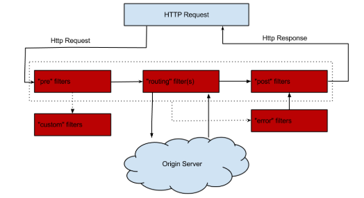

# Zuul

## 1 zuul介绍

Zuul提供动态路由，监控，弹性，安全等的边缘服务。Zuul是Netflix出品的一个基于JVM路由和服务端的负载均衡器。

Zuul与Ribbon以及Eureka配合：

Zuul、Ribbon以及Eureka结合可以实现智能路由和负载均衡的功能；网关将所有服务的API接口统一聚合，统一对外暴露。外界调用API接口时，不需要知道微服务系统中各服务相互调用的复杂性，保护了内部微服务单元的API接口；网关可以做用户身份认证和权限认证，防止非法请求操作API接口；网关可以实现监控功能，实时日志输出，对请求进行记录；网关可以实现流量监控，在高流量的情况下，对服务降级；API接口从内部服务分离出来，方便做测试。

Zuul通过Servlet来实现，通过自定义的ZuulServlet来对请求进行控制。核心是一系列过滤器，可以在Http请求的发起和响应返回期间执行一系列过滤器。Zuul采取了动态读取、编译和运行这些过滤器。过滤器之间不能直接通信，而是通过RequestContext对象来共享数据，每个请求都会创建一个RequestContext对象。

Filter是Zuul的核心，用来实现对外服务的控制。Filter的生命周期有4个，分别是“PRE”、“ROUTING”、“POST”、“ERROR”，整个生命周期可以用下图来表示。 



Zuul大部分功能都是通过过滤器来实现的，这些过滤器类型对应于请求的典型生命周期。

- **PRE：** 这种过滤器在请求被路由之前调用。我们可利用这种过滤器实现身份验证、在集群中选择请求的微服务、记录调试信息等。
- **ROUTING：**这种过滤器将请求路由到微服务。这种过滤器用于构建发送给微服务的请求，并使用Apache HttpClient或Netfilx Ribbon请求微服务。
- **POST：**这种过滤器在路由到微服务以后执行。这种过滤器可用来为响应添加标准的HTTP Header、收集统计信息和指标、将响应从微服务发送给客户端等。
- **ERROR：**在其他阶段发生错误时执行该过滤器。 除了默认的过滤器类型，Zuul还允许我们创建自定义的过滤器类型。例如，我们可以定制一种STATIC类型的过滤器，直接在Zuul中生成响应，而不将请求转发到后端的微服务。

### Zuul中默认实现的Filter

| 类型  | 顺序 | 过滤器                  | 功能                       |
| ----- | ---- | ----------------------- | -------------------------- |
| pre   | -3   | ServletDetectionFilter  | 标记处理Servlet的类型      |
| pre   | -2   | Servlet30WrapperFilter  | 包装HttpServletRequest请求 |
| pre   | -1   | FormBodyWrapperFilter   | 包装请求体                 |
| route | 1    | DebugFilter             | 标记调试标志               |
| route | 5    | PreDecorationFilter     | 处理请求上下文供后续使用   |
| route | 10   | RibbonRoutingFilter     | serviceId请求转发          |
| route | 100  | SimpleHostRoutingFilter | url请求转发                |
| route | 500  | SendForwardFilter       | forward请求转发            |
| post  | 0    | SendErrorFilter         | 处理有错误的请求响应       |
| post  | 1000 | SendResponseFilter      | 处理正常的请求响应         |

### 自定义Filter


```java
public class TokenFilter extends ZuulFilter {

    private final Logger logger = LoggerFactory.getLogger(TokenFilter.class);

    @Override
    public String filterType() {
        // 可以在请求被路由之前调用
        return "pre";
    }

    @Override
    public int filterOrder() {
        // filter执行顺序，通过数字指定 ，优先级为0，数字越大，优先级越低
        return 0;
    }

    @Override
    public boolean shouldFilter() {
        // 是否执行该过滤器，此处为true，说明需要过滤
        return true;
    }

    @Override
    public Object run() {
        return null;//执行的动作
    }
}
```

