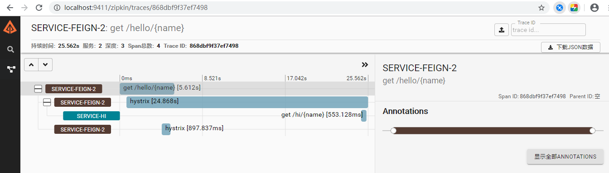

# zipkin

## 1 zipkin介绍

Spring Cloud Sleuth为服务之间调用提供链路追踪。通过Sleuth可以很清楚的了解到一个服务请求经过了哪些服务，每个服务处理花费了多长. 

- 耗时分析: 通过Sleuth可以很方便的了解到每个采样请求的耗时，从而分析出哪些服务调用比较耗时;
- 可视化错误: 对于程序未捕捉的异常，可以通过集成Zipkin服务界面上看到;
- 链路优化: 对于调用比较频繁的服务，可以针对这些服务实施一些优化措施。

Zipkin 是一个开放源代码分布式的跟踪系统，由Twitter公司开源，它致力于收集服务的定时数据，以解决微服务架构中的延迟问题，包括数据的收集、存储、查找和展现。 

每个服务向zipkin报告计时数据，zipkin会根据调用关系通过Zipkin UI生成依赖关系图，显示了多少跟踪请求通过每个服务，该系统让开发者可通过一个 Web 前端轻松的收集和分析数据，例如用户每次请求服务的处理时间等，可方便的监测系统中存在的瓶颈。 

## 2 演示

启动 zipkin 控制台执行: java -jar zipkin.jar

访问zipkin页面:  <http://localhost:9411/zipkin/> 

访问接口 :   <http://127.0.0.1:8765/hello/asdfasdf> 

